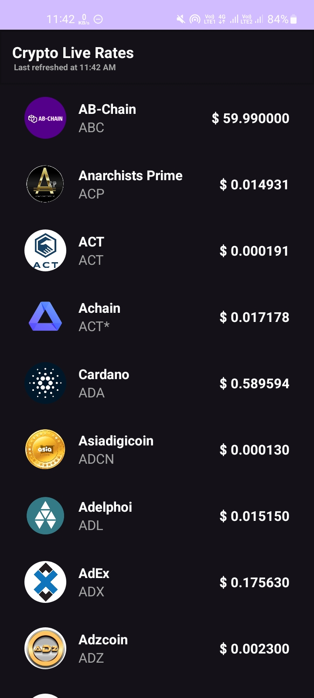
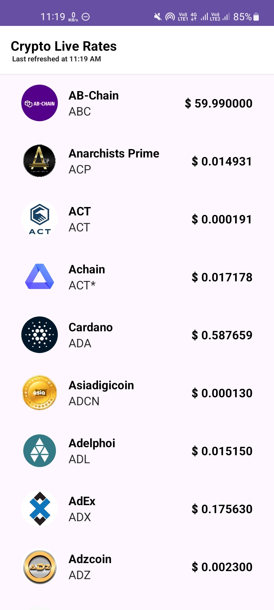

# Crypto Rate #

A demo app that fetches live crypto exchange rate.

## App Preview ##

  

## Features ##

1. Built with Kotlin and XML for layouts
2. MVVM and repository pattern
3. Showcases RecyclerView optimisations
4. Offline Cache with ROOM
5. Dark Mode support
6. Picasso for Image Loading
7. LiveData Event Handling
8. DataBinding and Binding Adapters
9. Dagger-Hilt for Dependency Injection
10. Error Handling and Retry mechanisms
11. No Internet Alert